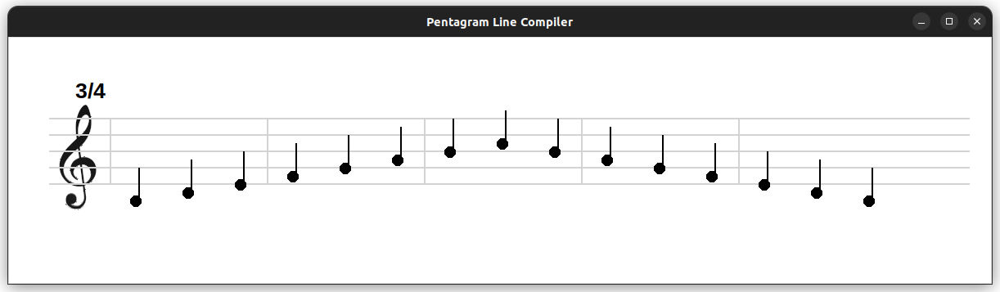

# Compiler Project

This is an example of a "compiler", but here the idea is to follow traditional compiler flow: `lexical analysis -> sintactial analysis -> semantical analysis -> translate to target code`.

In this case, this is just a compiler where the user should write a code as next example:
```
START
TIME <TIME_SIGNATURE>
<MUSIC>
END
```

`START`and `END` are __keywords__. `TIME` also is a __keyword__ but 
it should have a _signature time_ after the keyword. 
`<MUSIC>` is a structure of a sequence of pairs, where is pair is composed by a `NOTE` and a `DURATION`.

`NOTE` is based on english notation, it means from __A to G__. Each note could have an alterarion, `b`for bemol, `s` for sharp. After the note, the octave should be added, for now just use $4$ or $5$ _octave_.

`DURATION`is described as follows: $1$ (_whole-note_), $1/2$ (_half-note_), $1/4$ (_quarter-note_), $1/8$, and $1/16$.

## How to use

There is an `example.py` file where you could understand how to use the compiler.

With an input as next one:

```bash
START 
TIME 3/4
C4 1/4 D4 1/4 E4 1/4 F4 1/4 G4 1/4 A4 1/4 B4 1/4 C5 1/4 B 1/4 A 1/4G 1/4 F 1/4 E 1/4 D 1/4 C 1/4
END
```

The output of the compiler will look like as follows:



# Requirements

As the output of the compiler is an image create using `TKinter`, you should have installed this package into the machine where you are running the compiler.

Here some useful links:
- [TKinter on Windows](https://www.geeksforgeeks.org/how-to-install-tkinter-in-windows/)
- [TKinter on Linux](https://www.geeksforgeeks.org/how-to-install-tkinter-on-linux/)