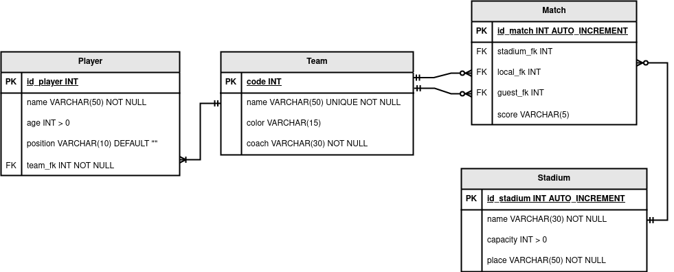

# Project Overview

Welcome to our simple project that provides web services integrated with both MySQL and PostgreSQL databases. This project demonstrates how to build RESTful APIs using FastAPI, and how to manage different database connections for various parts of your application.

## Introduction

This project is designed with simplicity and versatility in mind. It includes:
- **Web Services:** FastAPI endpoints to manage various operations for different entities (users, teams, players, stadiums, matches).
- **Database Connections:** Two separate database connections:
  - **MySQL:** Used for managing parts of the project data.
  - **PostgreSQL:** Used for other specific operations.
- **CRUD Operations:** Each domain (e.g., users, teams, players, stadiums, matches) is handled by individual CRUD classes that interact with their respective databases.

## Database Design

Our database schema is tailored for a football management system. It includes tables for teams, players, matches, and stadiums. See the ER diagram below that illustrates the database design:



## How to Use

There are two primary options to run the project:

### Option 1: Run with Uvicorn

You can execute the FastAPI app directly using Uvicorn. Open your terminal, navigate to the project root, and run:
```bash
uvicorn main:app --host 0.0.0.0 --reload
```

This command starts the development server with automatic reloading enabled.

### Option 2: Run with Docker Compose
For a containerized setup, use Docker Compose. In the project root, execute:

```bash
docker-compose up
```

## Technology Stack:

- __Backend__: FastAPI framework.
- __Databases__: MySQL and PostgreSQL.
- __Containerization__: Docker and Docker Compose.

Feel free to explore the repository and customize the setup according to your project requirements.